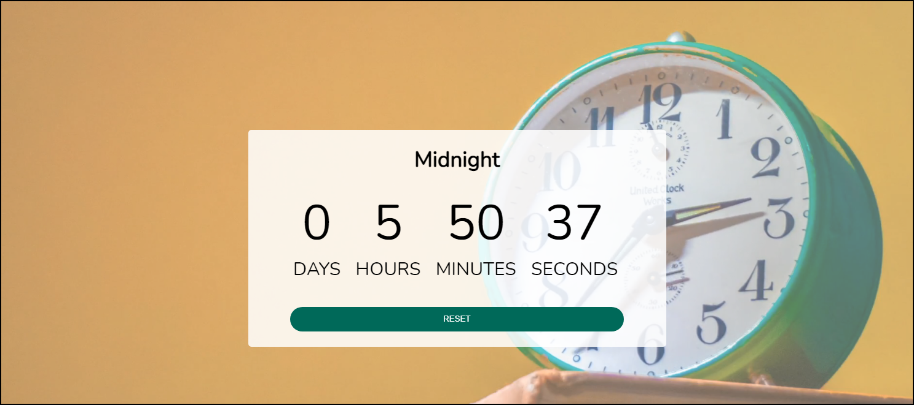

# Custom Countdown

> This readme file serves both to describe this project, serve as a sort-of design-doc, and as a reference for myself to return to when I need to implement a similar solution in a future project. This project is a custom countdown timer that flashes when the countdown reaches the appointed date.

---

## Link To Project

See the [Custom Countdown App](https://lundeen-bryan-custom-countdown.netlify.app/) on Netlify.

---

## Table of Contents

The following sections are bookmarked for easy reference.

- [Description](#description)
- [Technologies](#technologies)
- [How To Use](#how-to-use)
- [References](#references)
- [Future Plans](#future-plans)
- [Contributions](#contributions)
- [License](#license)
- [Author Info](#author-info)

---

## Description

This is a countdown timer that has a date field for the user to pick a date that they want to count down to such as an anniversary or appointment. It uses the browsers built-in date-picker form in HTML. The app stores cookies on the local machine so that when the user comes back to the app it will still hold the countdown time where they left off.  It was made slightly mobile responsive on a mobile screen but does not step down to each subsequent size.

Project based on [JavaScript Web Projects: 20 Projects to Build Your Portfolio](https://www.udemy.com/course/javascript-web-projects-to-build-your-portfolio-resume/)

### Technologies

- [Pixabay](https://pixabay.com/videos/) was used to find an mp4 movie to use as the background.
- A video compression tool called [YouCompress](https://www.youcompress.com/) was used to compress the video to a size more suitable for the web.
- Basic form hints have been used so that a screenreader can find the [form-related elements]( https://developer.mozilla.org/en-US/docs/Web/Accessibility/ARIA/forms/Basic_form_hints).
- To achieve a correct size in mobile view the container’s min-width was “unset” and then width to 95vw.
- Nunito font was used in the project from [Google fonts](https://fonts.google.com/?query=nunito) however form elements have their own font style so I changed the “input” style in css to font-family: nunito.
- I had quite a few problems with the date format. Essentially modern browsers will display dates per the users local machine settings. When creating an [input of the type "date"](https://developer.mozilla.org/en-US/docs/Web/HTML/Element/input/date) the value does not include the time. So this caused a problem because the value set by the user needed to be added to the current local time([see reference on w3schools](https://www.w3schools.com/jsref/jsref_obj_date.asp)). The suggestion by ZTM in the tutorial was to use the function [Date.toISOString](https://developer.mozilla.org/en-US/docs/Web/JavaScript/Reference/Global_Objects/Date/toISOString). However this converts a date to a text string that represents the number of milliseconds and is thrown off when the time is not included. The date input box only shows the date but not the time, therefore when comparing with local date (which includes the date **and** time) the calculations will be off by x minutes since midnight. I solved the problem by using the [getTimezoneOffset](https://developer.mozilla.org/en-US/docs/Web/JavaScript/Reference/Global_Objects/Date/getTimezoneOffset) function which returns minutes not milliseconds like the to ISOstring function does. So I had to multiply that by 60,000 miliseconds to get the right number that offset my timezone. This was then subtracted from the time that toISOstring was returning, because the GMT time produced by that function is x number of minutes ahead of my timezone in PST. A possible alternitive approach that was not tried due to time on hand was [Itl.DateTimeFormat](https://developer.mozilla.org/en-US/docs/Web/JavaScript/Reference/Global_Objects/Intl) but I decided to hold off a rewrite to my approach when I finally discovered this function. Along the way, I found a _**super excellent**_ cheatsheet for this format by [devhints.io](https://devhints.io/wip/intl-datetime). Note there are a lot of [methods](https://www.w3schools.com/jsref/jsref_obj_date.asp) included in Javascript for dealing with dates.
- String dates often have to be parsed so I used [slice](https://www.w3schools.com/jsref/jsref_slice_string.asp) to cut unwanted characters from the string and I used [split](https://www.w3schools.com/jsref/jsref_split.asp) to grab only what I needed.
- While creating the form a small problem occured when the user submits w/o entering a date in the date-picker. So I used an alert to tell the user they must enter a date in the field and used [preventDefault](https://www.w3schools.com/jsref/event_preventdefault.asp) event method to stop the form from being submitted.
- [w3schools](https://www.w3schools.com/js/js_timing.asp) has a really interesting demo of making a clock on a page.
- In the final step I set it up to cache the settings so that if a user leaves the page and comes back the time remains in the local storage. This has to be done by read/write in JSON format using [JSON.stringify](https://developer.mozilla.org/en-US/docs/Web/JavaScript/Reference/Global_Objects/JSON/stringify) and the results have to be [parsed](https://developer.mozilla.org/en-US/docs/Web/JavaScript/Reference/Global_Objects/JSON/parse) back into the javascript functions.

[Back To The Top](#custom-countdown)

---

## How To Use

### Installation

Installation is very easy, just visit the url, enter a title for the event, select a date from the date-picker and submit. If user wants to reset the event date, they can hit reset.

## Contributions

I am currently not accepting contributions to this project, however feel free to leave comments on the issues tab of this project for consideration.

---

## Future Plans

For the future I plan to redesign this so that a time can also be implemented and someone can see a countdown to the time of an event not just the day

[Back To The Top](#custom-countdown)

---

### Project Status

The current status of this project is in development.

[Back To The Top](#custom-countdown)

---

## License

<mitlicense>
Copyright &copy; [2020] [Bryan Lundeen]
  
MIT License
Permission is hereby granted, free of charge, to any person obtaining a copy of this software and associated documentation files (the "Software"), to deal in the Software without restriction, including without limitation the rights to use, copy, modify, merge, publish, distribute, sublicense, and/or sell copies of the Software, and to permit persons to whom the Software is furnished to do so, subject to the following conditions:
  
The above copyright notice and this permission notice shall be included in all copies or substantial portions of the Software.
  
THE SOFTWARE IS PROVIDED "AS IS", WITHOUT WARRANTY OF ANY KIND, EXPRESS OR IMPLIED, INCLUDING BUT NOT LIMITED TO THE WARRANTIES OF MERCHANTABILITY, FITNESS FOR A PARTICULAR PURPOSE AND NONINFRINGEMENT. IN NO EVENT SHALL THE AUTHORS OR COPYRIGHT HOLDERS BE LIABLE FOR ANY CLAIM, DAMAGES OR OTHER LIABILITY, WHETHER IN AN ACTION OF CONTRACT, TORT OR OTHERWISE, ARISING FROM, OUT OF OR IN CONNECTION WITH THE SOFTWARE OR THE USE OR OTHER DEALINGS IN THE SOFTWARE.
  
<mitlicense>
<!—
<dmca>
Protection: All original content on https://github.com/lundeen-bryan/ is created by the website owner or published under permission including but not limited to text, design, code, images, photographs and videos are considered to be the Intellectual Property of the website owner, whether copyrighted or not, and are protected by DMCA Protection Services using the Digital Millennium Copyright Act Title 17 Chapter 512 (c)(3). Reproduction or re-publication of this content is prohibited without permission.
  
Digital Millennium Copyright Act: Part of the US Copyright Law. The DMCA addresses penalties for copyright infringement on the Internet and protects content creators by "establishing procedures for proper notification" to OSPs when copyright infringement is identified online. Online Copyright Infringement Liability Limitation Act, Title II of the DMCA "adds a new section 512 to the Copyright Act to create four new limitations on liability for copyright infringement by online service providers." These procedures allow content creators or their designated agent to file proper DMCA Takedown notice to the OSP in case infringed material has been detected on their servers.
  
Please see [GitHub’s](https://docs.github.com/en/github/site-policy/dmca-takedown-policy) DMCA Policy for further details.
<dmca>
-->

[Back To The Top](#custom-countdown)

---

## Author Info

- Github - [lundeen-bryan](https://github.com/lundeen-bryan)
- LinkedIn - [BryanLundeen](https://www.linkedin.com/in/bryanlundeen/)
- Twitter – [@LundeenBryan](https://twitter.com/LundeenBryan)
- Facebook – [realbryanlundeen](https://www.facebook.com/realbryanlundeen)

[Back To The Top](#custom-countdown)

